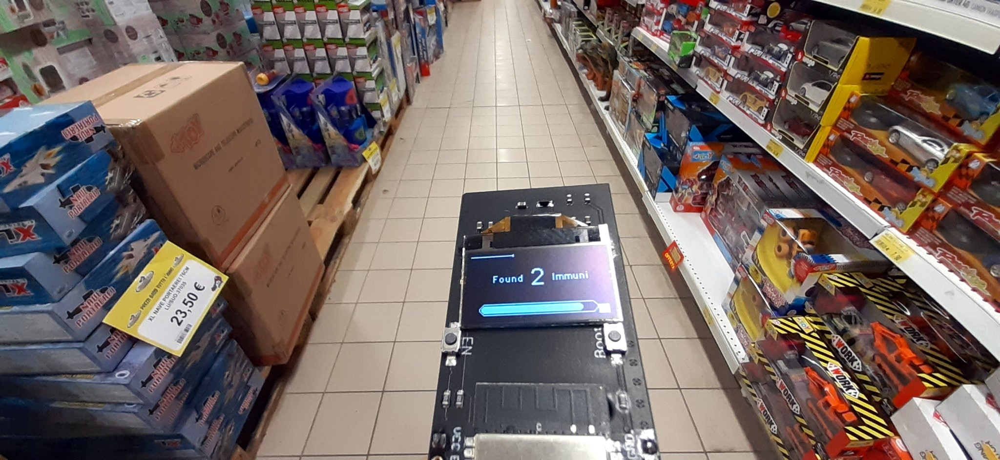

# ESP32_ImmuniScanner
## A simple Immuni App beacon detector

Just for fun, a simple BLE beacon detector for service UUID 0000fd6f-0000-1000-8000-00805f9b34fb, as described on https://blog.google/documents/58/Contact_Tracing_-_Bluetooth_Specification_v1.1_RYGZbKW.pdf, based on a
TTGO ESP32 board with onboard SSD1306 I2C display (https://it.aliexpress.com/item/1000007779002.html). I think that you can easily adapt this for other ESP32 boards.

Please note: due to random MAC generator, device detection couldn't be realiable. However, we'll try our best to keep update the numbers of Immuni app all around you ;-)

USE AT YOUR OWN RISK - NO ANY WARRANTY
